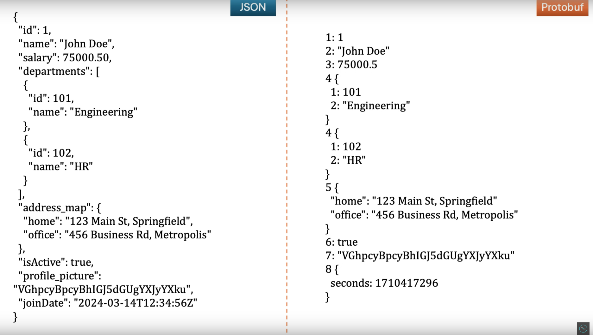

### Json after serializarion:

```json
{
    "id": 123,
    "name": "John",
    "salary": 5000
}
```

### gRPC after serialization

```json
{
  1: 123,
  2: "John",
  3: 5000
}
```

#### Example Java class:

```java
package org.grpc.protobuf;

import java.time.Instant;
import java.util.List;
import java.util.Map;

public class Employee {
    private int id;
    private String name;
    private double salary;
    private List<Department> departments;
    private Map<String, String> addressMap;
    private boolean isActive;
    private byte[] profilePicture;
    private Instant joinDate;
}
```

#### It's protobuf conversion:

We use .proto as an extension of file.

employee.proto

```protobuf
syntax = "proto3";
import "google/protobuf/timestamp.proto";
package com.grpc.protobuf;

message Employee {
  int32                     id = 1;
  string                    name = 2;
  double                    salary = 3;
  repeated Department       department = 4;
  map<string, string>       addressMap = 5;
  bool                      isActive = 6;
  bytes                     profilePicture = 7;
  google.protobuf.Timestamp joinDate = 8;
}

message Department {
  int32   id = 1;
  string  name = 2;
}
```

### Java to Protobuf type mappings

|   Java    |         ProtoBuf          |
|:---------:|:-------------------------:|
|    int    |           int32           |
|   long    |           int64           |
|  boolean  |           bool            |
|  double   |          double           |
|   float   |           float           |
|  String   |          string           |
|  byte[]   |           bytes           |
|   List    |         repeated          |
| Map<X, Y> |         map<x, y>         |
|  Instant  | google.protobuf.Timestamp |
|   class   |          message          |
| Optional  |         optional          |



### Creating a contract

This is similar to Java's interfaces.

```protobuf
message Empty {

}

message EmployeeList {
  repeated Employee employees=1;
}

// similar to interface in Java
service EmployeeService {

  // rpc methodName(messageType1) returns (messageType2); // We always have to pass messageType1, and messageType2

  rpc getEmployee(Employee) returns (Employee);
  rpc addEmployee(Employee) returns (Employee);
  rpc getAllEmployees(Empty) returns (EmployeeList);
}
```

Complete code of employee.proto:

```protobuf
syntax = "proto3";

option java_multiple_files=true;
option java_package="com.grpc";
option java_outer_classname="EmployeeProto";
import "google/protobuf/timestamp.proto";
package com.grpc;

message Employee {
  int32                     id = 1;
  string                    name = 2;
  double                    salary = 3;
  repeated Department       department = 4;
  map<string, string>       addressMap = 5;
  bool                      isActive = 6;
  bytes                     profilePicture = 7;
  google.protobuf.Timestamp joinDate = 8;
}

message Department {
  int32   id = 1;
  string  name = 2;
}

message Empty {

}

message EmployeeList {
  repeated Employee employees=1;
}

// similar to interface in Java
service EmployeeService {

  // rpc methodName(messageType1) returns (messageType2); // We always have to pass messageType1, and messageType2

  rpc getEmployee(Employee) returns (Employee);
  rpc addEmployee(Employee) returns (Employee);
  rpc getAllEmployees(Empty) returns (EmployeeList);
}
```