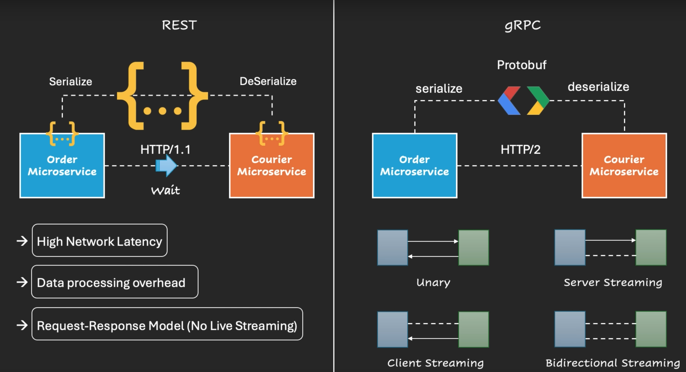
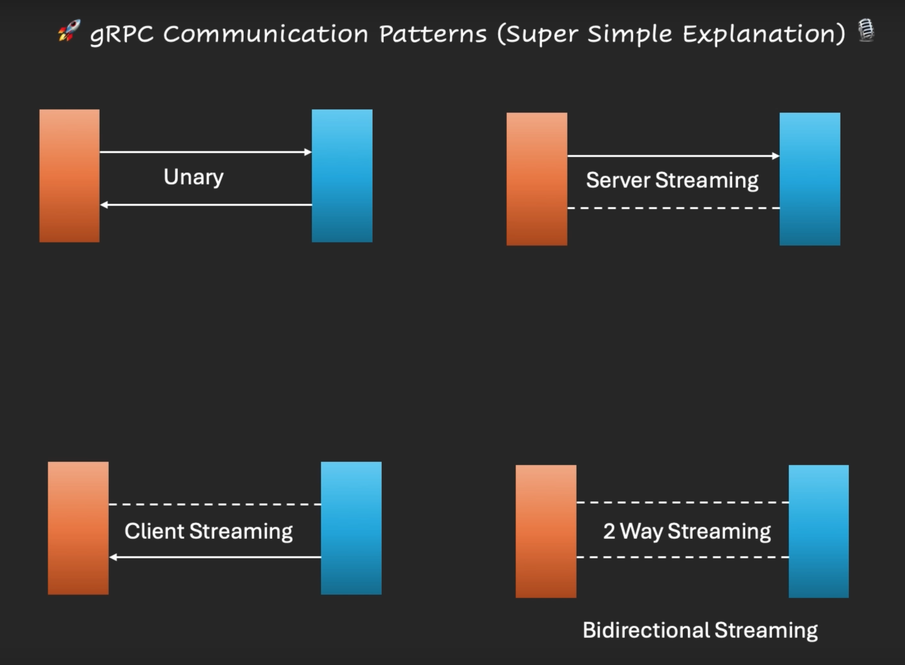
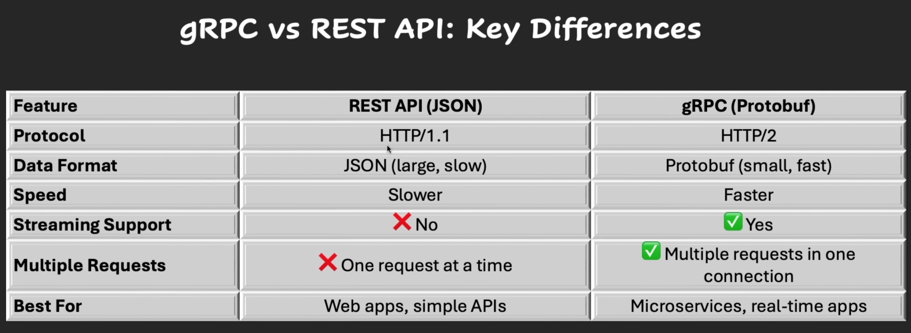

https://www.youtube.com/watch?v=1yjAUY1ifUg

gRPC: Google Remote Procedure Call

Speed, Low data usage, real-time communications.

Useful for microservices, cloud apps and backend services.

Problems with REST:

1. High Network Latency
2. Data processing overhead
3. Request-Response Model(No Live Streaming)

REST uses HTTP/1.1
gRPC uses HTTP/2

gRPC uses single connection for multiple calls.
gRPC uses Protobuf(binary format with compressed data) Faster serialization and deserialization.

4 different types of communication patterns:
1. Unary (1 request, 1 response)
2. Server streaming (1 request, multiple/continuous responses) (eg: video streaming)
3. Client streaming (multiple/continuous requests, 1 response) (eg: multiple file uploads)
4. Bidirectional streaming (continuous requests, continuous responses) (eg: live chat server, client)

